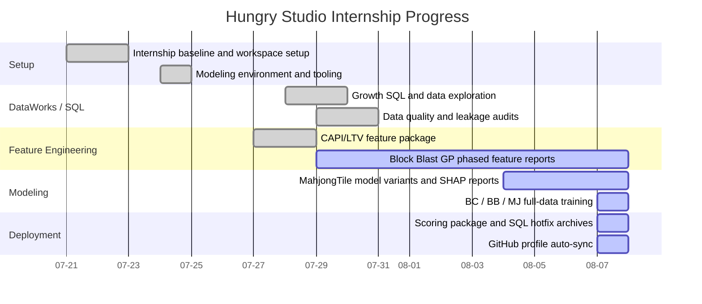
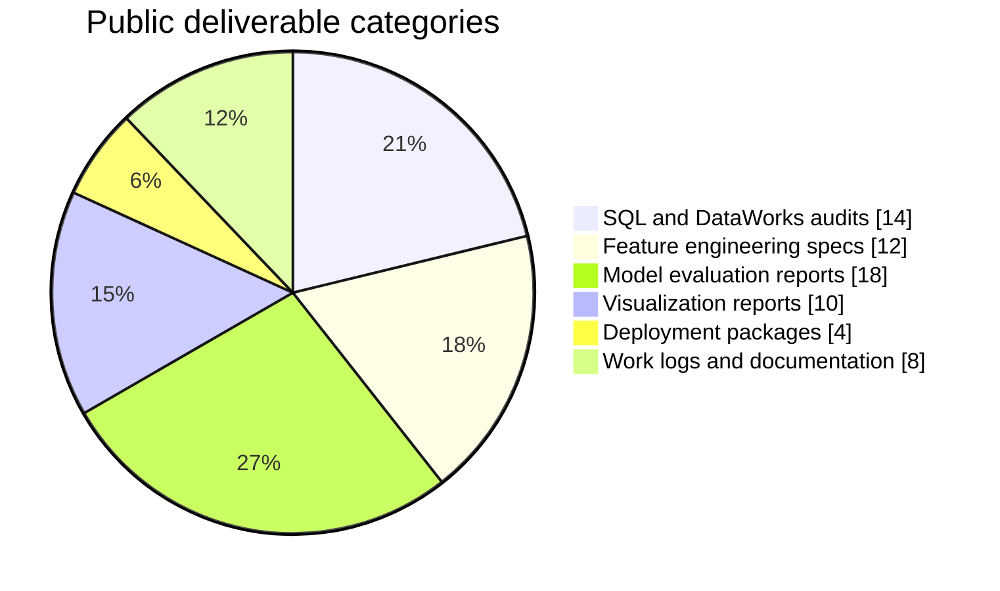
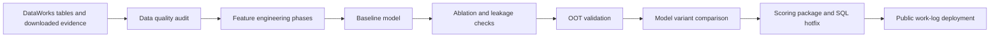
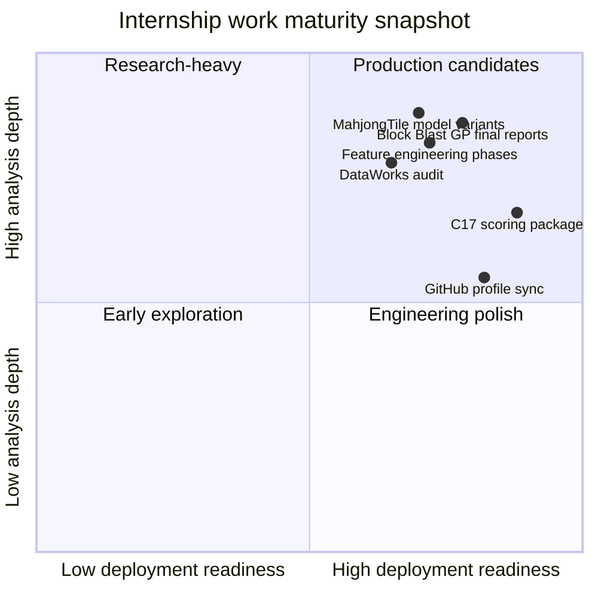

# Hungry Studio Internship Visual Summary

Last synced: 2026-08-07 17:45 Asia/Shanghai

This page visualizes public-safe Hungry Studio internship outcomes from 2026-07-21 onward. It uses summaries and artifact categories only; raw company data and sensitive implementation details are not published.

## Work Timeline

## Deliverable Mix

## Modeling Iteration Map

## Work Content vs Work Output

| Area | Work Content | Work Output |
|---|---|---|
| Data audit | Checked table scale, field quality, missingness, time-window boundaries, and leakage risk. | DataWorks SQL, TSV evidence tables, audit JSON, data-quality reports. |
| Feature engineering | Built staged Block Blast GP feature plans and reduced redundant or unstable features. | Feature specs, manifests, phase SQL, redundancy/stability CSVs, processing reports. |
| Modeling | Compared model variants across ranking, amount prediction, device hierarchy, CPI/manufacturer/RAM, and country/device/carrier settings. | Metrics CSVs, feature importance, SHAP-style reports, robustness checks, holdout predictions. |
| Visualization | Built readable HTML/PDF/PNG summaries for audits, feature behavior, OOT maturity, ablation, and final model effect. | Visual reports, comparison charts, full-stage workflow summary PDFs. |
| Deployment | Prepared MahjongTile hourly scoring package, model manifests, SQL hotfixes, and deployment archives. | `mahjongtile_hourly_model`, C17 deploy update archive, C17 SQL hotfix archive. |
| Profile sync | Maintained public GitHub profile logs for daily internship work. | `README.md`, `DAILY_WORK_LOG.md`, internship log, visual summary, scheduled sync task. |

## Readable Progress Snapshot

## Public Boundary

- The charts show progress categories and public-safe artifact types.
- Raw business data, credentials, private repository details, internal URLs, and unreviewed sensitive tables are not published.
- Visual summaries are updated together with the daily work log three times per day.
