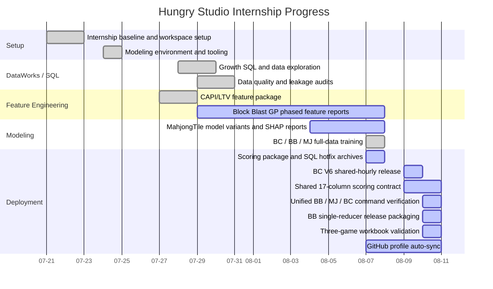
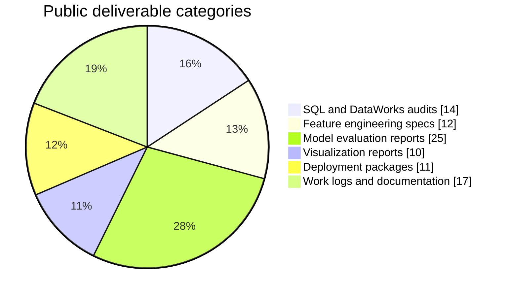
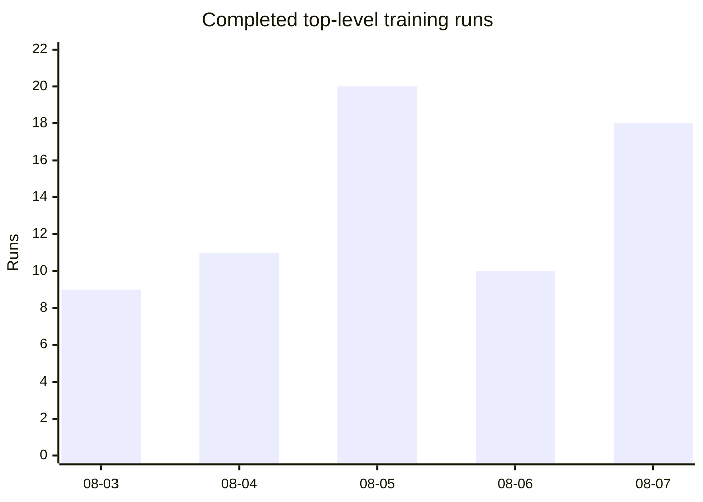
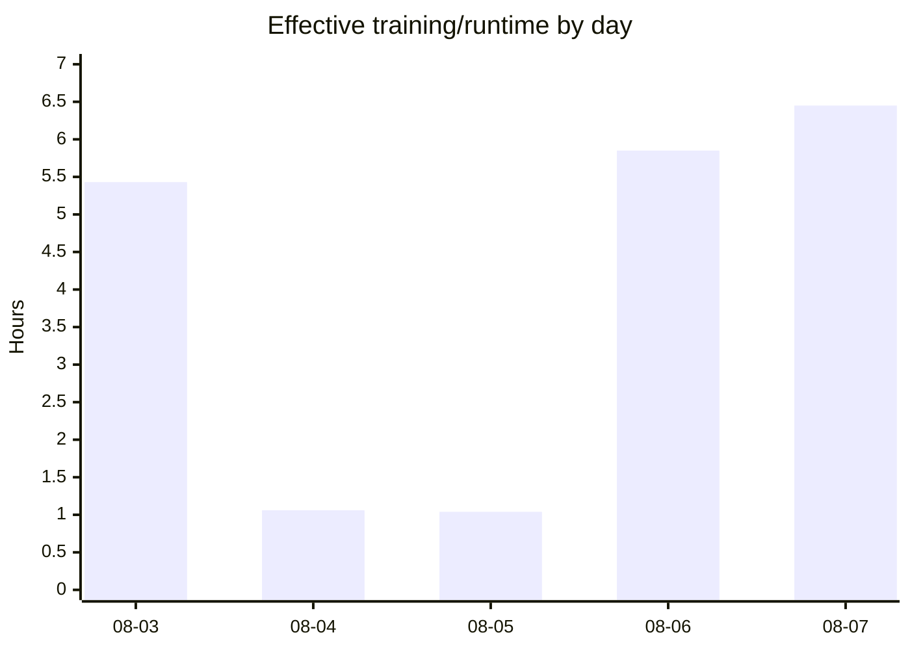
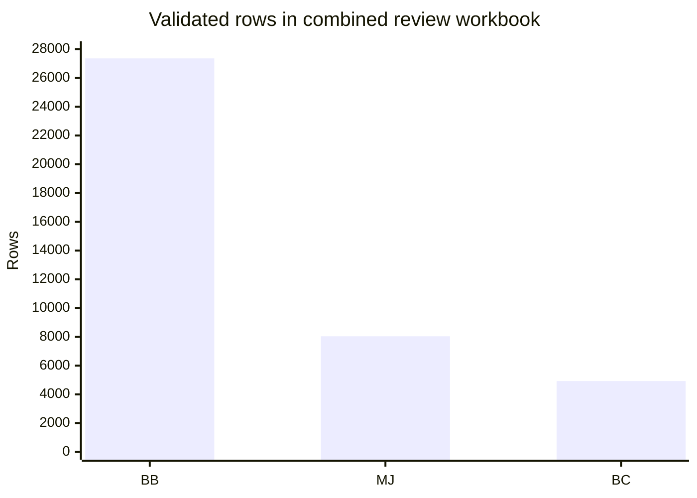
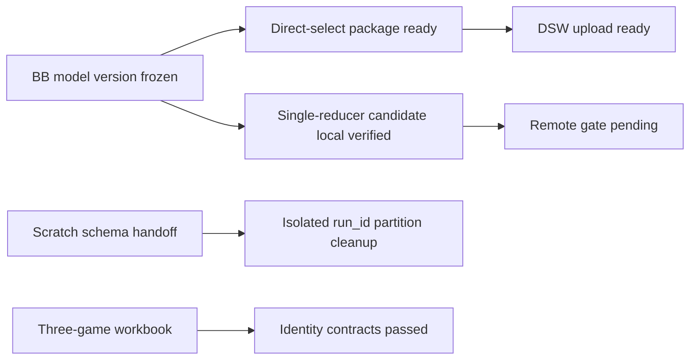
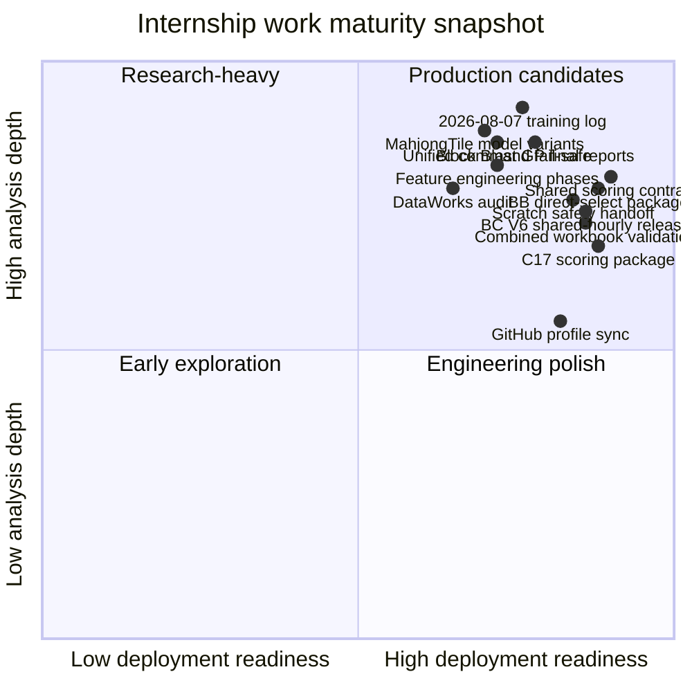

# Hungry Studio Internship Visual Summary

Last synced: 2026-08-10 20:01 Asia/Shanghai

This page visualizes public-safe Hungry Studio internship outcomes from 2026-07-21 onward. It uses summaries and artifact categories only; raw company data and sensitive implementation details are not published.

## Work Timeline

## Deliverable Mix

## Training Run Volume

## Training Runtime

## Modeling Iteration Map

```mermaid
flowchart LR
    A["DataWorks tables and downloaded evidence"] --> B["Data quality audit"]
    B --> C["Feature engineering phases"]
    C --> D["Baseline model"]
    D --> E["Ablation and leakage checks"]
    E --> F["OOT validation"]
    F --> G["Model variant comparison"]
    G --> H["Scoring package and SQL hotfix"]
    H --> I["Scratch-table and single-reducer safety gate"]
    I --> J["Three-game workbook validation"]
    J --> K["Public work-log deployment"]
```

## Work Content vs Work Output

| Area | Work Content | Work Output |
|---|---|---|
| Data audit | Checked table scale, field quality, missingness, time-window boundaries, and leakage risk. | DataWorks SQL, TSV evidence tables, audit JSON, data-quality reports. |
| Feature engineering | Built staged Block Blast GP feature plans and reduced redundant or unstable features. | Feature specs, manifests, phase SQL, redundancy/stability CSVs, processing reports. |
| Modeling | Compared model variants across ranking, amount prediction, device hierarchy, CPI/manufacturer/RAM, and country/device/carrier settings. | Metrics CSVs, feature importance, SHAP-style reports, robustness checks, holdout predictions. |
| Visualization | Built readable HTML/PDF/PNG summaries for audits, feature behavior, OOT maturity, ablation, and final model effect. | Visual reports, comparison charts, full-stage workflow summary PDFs. |
| Deployment | Prepared MahjongTile hourly scoring package, model manifests, SQL hotfixes, and deployment archives. | `mahjongtile_hourly_model`, C17 deploy update archive, C17 SQL hotfix archive. |
| Shared scoring | Packaged Block Crush V6 for the shared three-game hourly value table with exact partition protection. | `BC-V6-SHARED-HOURLY-20260809-R1`, DSW rollout notes, acceptance SQL, release manifest. |
| Unified runtime | Verified 17-column BB/MJ/BC shared-table contract, command format, dry-run path, and fail-safe cancellation. | Shared schema migration evidence, unified command verification JSON, runtime effect JSON, release package index. |
| BB packaging | Prepared direct-select and single-reducer Block Blast deployment candidates while preserving remote-gate separation. | `bb_model006_v2_single_reducer_direct_select_20260810_v3`, `bb_model006_v2_single_reducer_direct_20260810_v1`, release manifests. |
| Scratch safety | Converted scratch-admin needs into a minimal-permission handoff with isolated table scope and exact `run_id` partition cleanup. | Scratch handoff docs, 147-column schema contract, privilege-boundary notes. |
| Workbook validation | Built a visible three-game review workbook and checked identity/rank/formula contracts. | `three_games_combined_visible_20260810.xlsx`, validation JSON, acceptance screenshots. |
| Profile sync | Maintained public GitHub profile logs for daily internship work. | `README.md`, `DAILY_WORK_LOG.md`, internship log, visual summary, scheduled sync task. |

## Shared Deployment Gate Snapshot

| Gate | Status | Public-safe result |
|---|---|---|
| Shared schema migration | Passed | `distinct_id` added as the 17th business column; `dt/hour/bundle_id` partitions unchanged. |
| BB remote gate V2 | Passed | 27,362 rows; unique IDs and hashes match; rank and value checks pass. |
| MJ remote gate V2 | Passed | 8,041 rows; BB partition unchanged; BC partition not written yet. |
| BC R3-HF1 package | Ready | Hotfix package prepared with exact partition scope and runtime dependency guard. |
| Unified command dry-run | Passed | BB, MJ, and BC dry-run paths all succeeded. |
| Unified real no-publish SLA | Blocked safely | BB SQL exceeded the 120s SLA; fail-safe cancelled remote execution and prevented writes. |
| BB direct-select package | Ready | `bb_model006_v2_single_reducer_direct_select_20260810_v3` is ready for DSW upload after local packaging validation; compressed checksum `3ef72bfe7537c3280864abf6f90e7f2b2c5359b6bb24c5556c83f5fbbe1cdfda` is tracked. |
| BB single-reducer candidate | Pending remote gate | `bb_model006_v2_single_reducer_direct_20260810_v1` is local-verified; promotion waits for remote validation. |
| Scratch-table handoff | Ready | Uses isolated scratch table, authoritative 147-column schema, exact `run_id` partition cleanup, and no shared-table mutation privilege. |
| Three-game workbook | Passed | 40,331 total rows; BB 27,362 / MJ 8,041 / BC 4,928; all identity contracts pass and formula errors are 0. |

## Three-Game Workbook Distribution

## Evening Deployment Gate Flow

## 2026-08-07 Model Training Snapshot

| Game | Completed runs | Runtime | Main signal |
|---|---:|---:|---|
| Block Blast | 8 | 4h 57m 25s | Full CatBoost rank/positive, trajectory, retention, recency, stacker, and growth-interaction checks. |
| Block Crush | 9 | 1h 13m 26s | LightGBM baseline, seed stability, Tweedie, recency weighting, weekday amount, CatBoost migration, and deep-capacity checks. |
| Mahjong Tile | 1 | 15m 51s | C17 trajectory challenge model; C8 remains the official frozen baseline until fresh OOT validation. |
| Total | 18 | 6h 26m 42s | Successful runs are separated from interrupted, failed, scoring-only, and calibration-only work. |

## Readable Progress Snapshot

## Public Boundary

- The charts show progress categories and public-safe artifact types.
- Raw business data, credentials, private repository details, internal URLs, and unreviewed sensitive tables are not published.
- Visual summaries are updated together with the daily work log three times per day.
